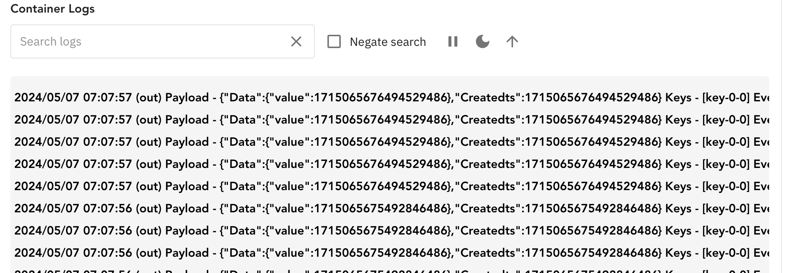
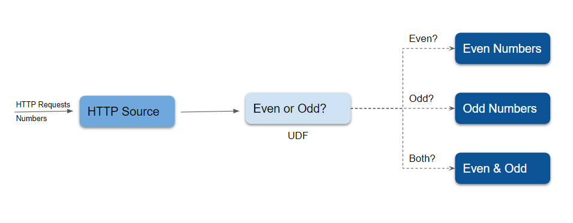
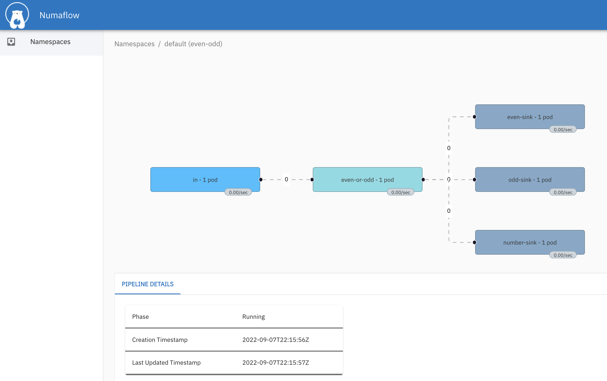

# Numaflow Workshop

This workshop guides you through to install Numaflow in a local Kubernetes cluster, and run couple of pipelines for data processing.

## Prerequisites

Setup one of the tools to run container images:

- [Docker Desktop](https://docs.docker.com/get-docker/)
- [Rancher Desktop](https://rancherdesktop.io/)
- [Podman](https://podman.io/)

## A Local K8s Cluster

Install a local K8s cluster, if you don't have.

- [k3d](https://k3d.io/)

  ```shell
    brew install k3d
    k3d cluster create
  ```

- [kind](https://kind.sigs.k8s.io/)

  ```shell
  brew install kind
  kind create cluster

  # Install the metrics server
  kubectl apply -f https://github.com/kubernetes-sigs/metrics-server/releases/latest/download/components.yaml
  kubectl patch -n kube-system deployment metrics-server --type=json -p '[{"op":"add","path":"/spec/template/spec/containers/0/args/-","value":"--kubelet-insecure-tls"}]'
  ```

- [minikube](https://minikube.sigs.k8s.io/docs/start/)

  ```shell
  brew install minikube
  minikube start
  ```

## Install Numaflow

```shell
kubectl create ns numaflow-system
kubectl apply -k https://github.com/numaproj/numaflow-workshop/manifests/installation
# Install an InterStepBufferService
kubectl apply -f https://raw.githubusercontent.com/numaproj/numaflow/stable/examples/0-isbsvc-jetstream.yaml
```

You will see pods as like below in `default` namespace.

```
kubectl get po

NAME                                     READY   STATUS             RESTARTS      AGE
isbsvc-default-js-0                      3/3     Running            0             116s
isbsvc-default-js-1                      3/3     Running            0             116s
isbsvc-default-js-2                      3/3     Running            0             116s
```

## Run Your 1st Pipeline

```shell
kubectl apply -f https://raw.githubusercontent.com/numaproj/numaflow-workshop/main/manifests/1-simple-pipeline.yaml

kubectl get pl # View pipelines
kubectl get vtx # View vertices
kubectl get po # Check if pods are running

# Port forward the UI to https://localhost:8443/
kubectl -n numaflow-system port-forward deployment/numaflow-server 8443:8443
```

Navigate to `default` namespace, and view the pipeline from the UI.

Find the logs in the `out` vertex as below:



The pipeline can be deleted by

```shell
kubectl delete -f https://raw.githubusercontent.com/numaproj/numaflow-workshop/main/manifests/1-simple-pipeline.yaml
```

## Build an Advanced Pipeline

Now we will walk you through creating an advanced pipeline. In our example, this is called the `even-odd` pipeline, illustrated by the following diagram:



There are five vertices in this example of an advanced pipeline. An `HTTP` source vertex which serves an HTTP endpoint to receive numbers as source data, a `UDF` vertex to tag the ingested numbers with the key `even` or `odd`, three `Log`sinks, one to print the `even` numbers, one to print the `odd` numbers, and the other one to print both the even and odd numbers.

Run the following command to build the User-Defined Function image, it will import the built image to the local cluster.

```shell
make image
```

Run the following command to create the `even-odd` pipeline.

```shell
kubectl apply -f https://raw.githubusercontent.com/numaproj/numaflow-workshop/main/manifests/2-even-odd-pipeline.yaml
```

You may opt to view the list of pipelines you've created so far by running `kubectl get pipeline`. Otherwise, proceed to inspect the status of the pipeline, using `kubectl get pods`.

```shell
# Wait for pods to be ready
kubectl get pods

NAME                               READY   STATUS    RESTARTS   AGE
even-odd-daemon-64d65c945d-vjs9f   1/1     Running   0          5m3s
even-odd-even-or-odd-0-pr4ze       2/2     Running   0          30s
even-odd-even-sink-0-unffo         1/1     Running   0          22s
even-odd-in-0-a7iyd                1/1     Running   0          5m3s
even-odd-number-sink-0-zmg2p       1/1     Running   0          7s
even-odd-odd-sink-0-2736r          1/1     Running   0          15s
isbsvc-default-js-0                3/3     Running   0          10m
isbsvc-default-js-1                3/3     Running   0          10m
isbsvc-default-js-2                3/3     Running   0          10m
```

You also can view the pipeline from the UI at https://localhost:8443/.



Next, port-forward the HTTP endpoint, and make a `POST` request using `curl`.

```shell
kubectl port-forward svc/even-odd-in 8444:8443

# Post data to the HTTP endpoint
curl -kq -X POST -d "101" https://localhost:8444/vertices/in
curl -kq -X POST -d "102" https://localhost:8444/vertices/in
curl -kq -X POST -d "103" https://localhost:8444/vertices/in
curl -kq -X POST -d "104" https://localhost:8444/vertices/in
```

Now you can watch the log for the `even` and `odd` vertices by running the commands below.

```shell
# Watch the log for the even vertex, or check the log from the even-sink vertex in the UI
kubectl logs -f even-odd-even-sink-0-xxxxx
2024/05/07 07:21:28 (even-sink)  Payload -  102  Keys -  []  EventTime -  1715066488069  Headers -  Content-Type: application/x-www-form-urlencoded, User-Agent: curl/8.4.0, Accept: */*, Content-Length: 3,
2024/05/07 07:21:29 (even-sink)  Payload -  104  Keys -  []  EventTime -  1715066488835  Headers -  User-Agent: curl/8.4.0, Accept: */*, Content-Length: 3, Content-Type: application/x-www-form-urlencoded,

# Watch the log for the odd vertex, or check the log from the odd-sink vertex in the UI
kubectl logs -f even-odd-odd-sink-0-xxxxx
2024/05/07 07:21:28 (odd-sink)  Payload -  101  Keys -  []  EventTime -  1715066488020  Headers -  Content-Length: 3, Content-Type: application/x-www-form-urlencoded, User-Agent: curl/8.4.0, Accept: */*,
2024/05/07 07:21:28 (odd-sink)  Payload -  103  Keys -  []  EventTime -  1715066488133  Headers -  Accept: */*, Content-Length: 3, Content-Type: application/x-www-form-urlencoded, User-Agent: curl/8.4.0,

```

### Make Some Changes

Clone the repo, and update the logic in User-Defined Function [code](even-odd/main.go), re-run `make image`, repeat operations above to see if it reflects the changes.

The pipeline can be deleted by

```shell
kubectl delete -f https://raw.githubusercontent.com/numaproj/numaflow-workshop/main/manifests/2-even-odd-pipeline.yaml
```

## Clean Up

```shell
kubectl delete -f https://raw.githubusercontent.com/numaproj/numaflow/stable/examples/0-isbsvc-jetstream.yaml
kubectl delete -k https://github.com/numaproj/numaflow-workshop/manifests/installation
kubectl delete ns numaflow-system
```
